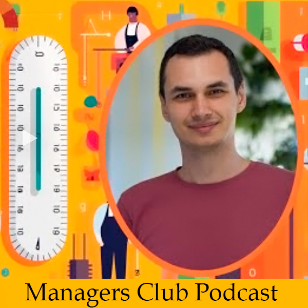

  

<h1 align="center">Hi , I'm Ivan Bilan </h1>

<h3 align="center">A passionate Engineering Manager in the field of Identity and Access Rights, Data, AI, NLP and more </h3>

<h3 align="center"> 🎙️ Podcast Appearances</h3>

         

<h3 align="center"> 🎥️ My Presentations</h3>

<a href="https://www.youtube.com/watch?v=VRur3xey31s">Introduction to NLP for Industry Use | DataTalksClub | 2021 </a> 
<a href="https://www.youtube.com/watch?v=0S9iai4Ld4I">In Search of Best Practices for NLP Projects | PyData Pune Meetup | 2020</a> 
<a href="https://www.youtube.com/watch?v=OYygPG4d9H0">Understanding and Applying Self-Attention for NLP | PyData Berlin | 2018</a> 

     
    <a target="_blank" href="https://linkedin.com/in/ivan-bilan"></img></a>
    <a target="_blank" href="https://medium.com/@ivanbilan"></img></a>
     
    

  

