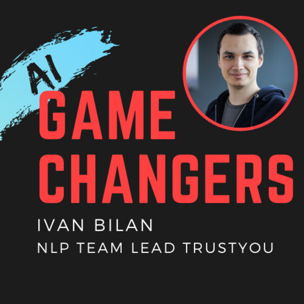
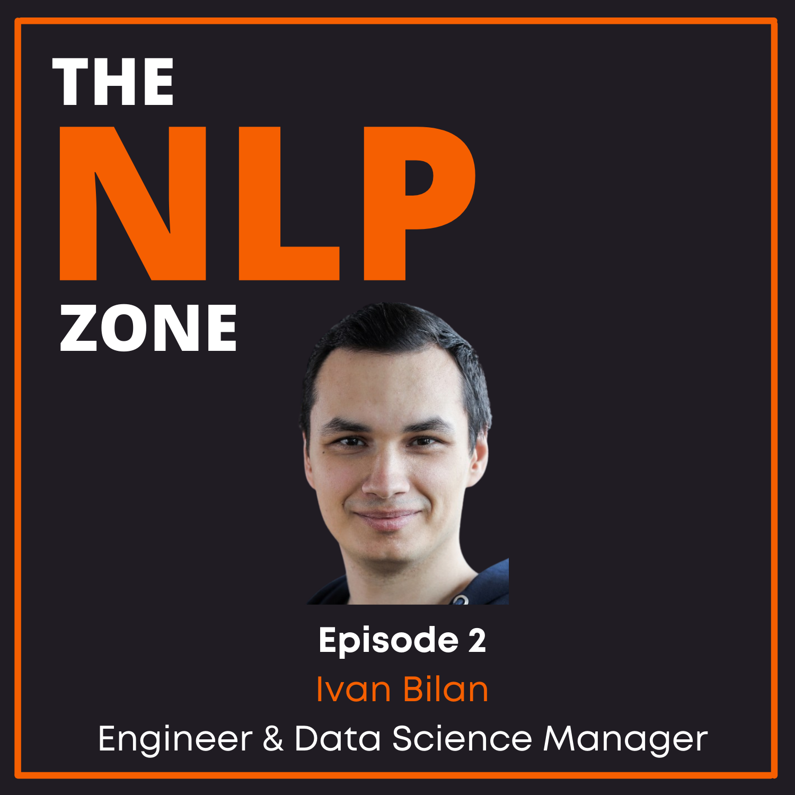
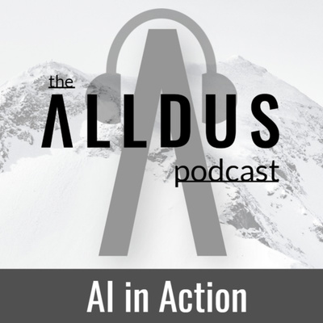
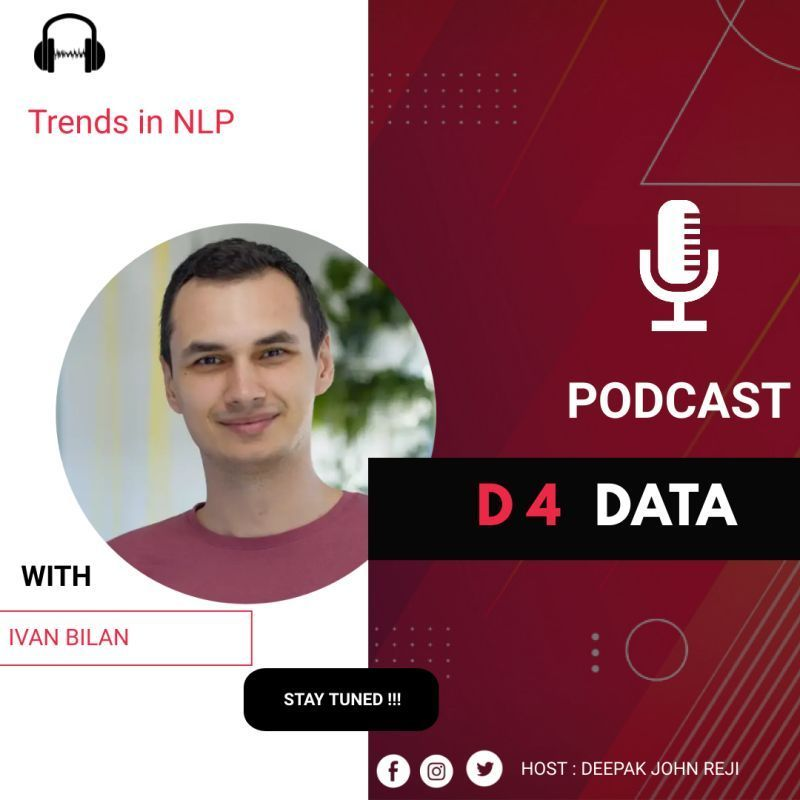
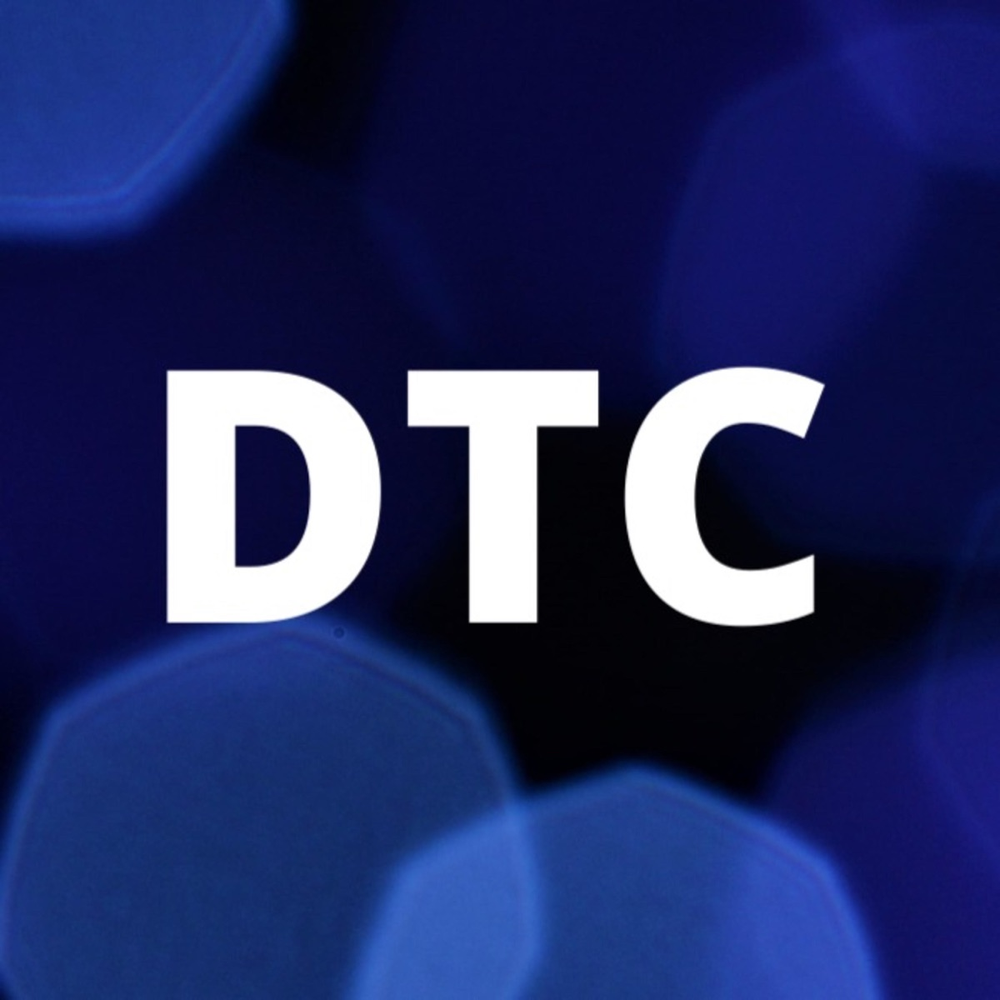

  

<h1 align="center">Hi , I'm Ivan Bilan </h1>

<h3 align="center">A passionate Engineering Manager in the field of data and beyond </h3>

<h3 align="center">My Tech Stack</h3>

             

<h3 align="center">Podcast Appearances</h3>

      

     
    <a target="_blank" href="https://linkedin.com/in/ivan-bilan"></img></a>
    <a target="_blank" href="https://medium.com/@ivanbilan"></img></a>
     
    

  
